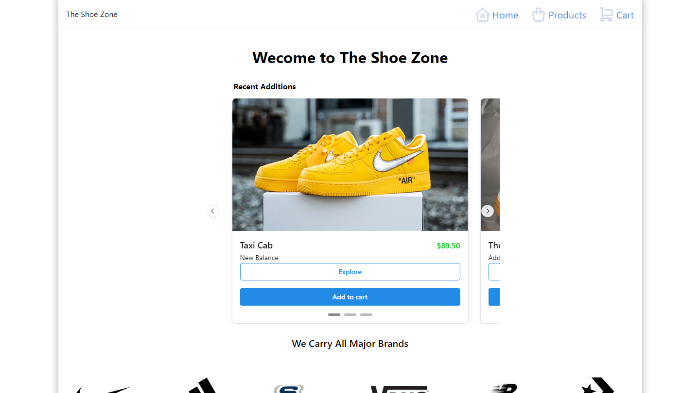

# Frontend Mentor - Invoice app solution

This is a fictional eCommerce website entitled "The Shoe Zone" which features several real-world use-cases incorporated into a single full-stack project.

## Table of contents

- [Overview](#overview)
  - [Screenshot](#screenshot)
  - [Objectives](#objectives)
  - [Links](#links)
- [My process](#my-process)
  - [Built with](#built-with)
  - [Methods](#methods)
  - [What I learned](#what-i-learned)
  - [Continued development](#continued-development)
- [Author](#author)
- [Acknowledgments](#acknowledgments)

## Overview

### Screenshot

### Objectives

This app was designed with a few objectives in mind:

- Retrieve data from a SQL database
- Fetch data on the frontend while displaying a loading state
- Provide a realtime shopping cart which can handle item quantities and show a cart total
- Allow for a simulated checkout process which saves the checkout data (minus payment info) to the database
- Provide a method for ratings and reviews on each store item
- Utilize a flexible and extensive UI component library

### Links

- Live Site URL: [Hosted on Netlify](https://the-shoe-zone.netlify.app/)

## My process

### Built with

- [React](https://reactjs.org/)
- [React-Router](https://reactrouter.com/en/main)
- [Supabase](https://supabase.com/)
- [Postgres](https://www.postgresql.org/)
- [Tanstack Query](https://tanstack.com/query/v3/)
- [Mantine](https://mantine.dev/)

### Methods

The app shell is built with React with a simple routing scheme via React-Router. The overall site organization is:

~~~
- Home Page
| - Products List
  | - Product (by ID)
- Cart Page
- Checkout Page
- Confirmation Page
~~~

On initial load, a loading state is shown while the database is queried for the individual products. All products are queried as a batch on initial load regardless of the route requested, whereas only on the 'Product by ID' page will an individual product be queried as well as the reviews associated with said product.

Four tables were created for this project, Products, Reviews, Addresses, and Orders. Products are stored in the products table, however reviews are stored independently and utilize a foreign key relationship with their associated product. Orders are stored in the orders table while addresses are stored independently with the intent to minimize database usage in the event of repeat customers (if this were a real production application).

The shopping cart feature utilizes the React Context API to ensure all data can be accessed and mutated anywhere in the application. A Header component exists outside of the Routes component to ensure a simple-view cart can be accessed on any page and products can be deleted or have their quantity modified at any point. The cart total will update immediately upon such an event.

### What I learned

Calculating and formatting the costs of each item as well as the product and cart totals proved a very real challenge. I chose not to use a library to handle the formatting and instead wanted to implement my own solution. The largest road block was that prices are stored as strings in the database, but needed to be summed and processed as numbers and then returned to strings for storage. Compensating for edge cases, such as when the decimal amount was a multiple of 10 (leading to cutting of the trailing zero) or when calculating cost resulted in several decimal places required a lot of trial and error, however I discovered a simple way of going about this by splitting the operation into four main functions:

~~~
export const calculateCost = (price: string, quantity: number) => {
    const [dollarsStr, centsStr] = price.split('.')

    const dollars = sumDollars(dollarsStr, centsStr, quantity)

    const cents = sumCents(centsStr, quantity)

    return costToString(dollars, cents)
}

export const sumDollars = (dollarsStr: string | number, centsStr: string | number, quantity?: number) => {
    const multiplier = quantity || 1

    const dollars = Number(dollarsStr) * multiplier

    const dollarsFromCents = Math.floor((Number(centsStr) * multiplier) / 100)

    return dollars + dollarsFromCents
}

export const sumCents = (centsStr: string | number, quantity?: number) => {
    const multiplier = quantity || 1

    const cents = Number(centsStr) * multiplier

    return cents % 100
}

export const costToString = (dollars: number, cents: number) => {
    const costStr = dollars.toString().concat('.')

    return cents < 10 ? costStr.concat('0', cents.toString()) : costStr.concat(cents.toString())
}
~~~

After several iterations and methods of testing, this method proved to be the most reliable and led to predictable and satisfactory results following several rounds of testing.

### Continued development

This project was my first using a component library vice custom components and CSS, which was more challenging than I initially thought it would be. For future projects I plan on implementing UI libraries more often, even in part or to supplement my own frontend frameworks.

## Author

- Portfolio - [ryanbradleyportfolio.com](https://ryanbradleyportfolio.com)
- Professional Site - [ryanbradleywebdev.com](https://ryanbradleywebdev.com)
- Instagram - [@ryanbradley_web_dev](https://www.instagram.com/ryanbradley_web_dev/)

## Acknowledgments

Additional libararies and resources I used for the creation of this project:

- [Tabler Icons](https://tabler-icons-react.vercel.app/)
- [Typescript](https://www.typescriptlang.org/)